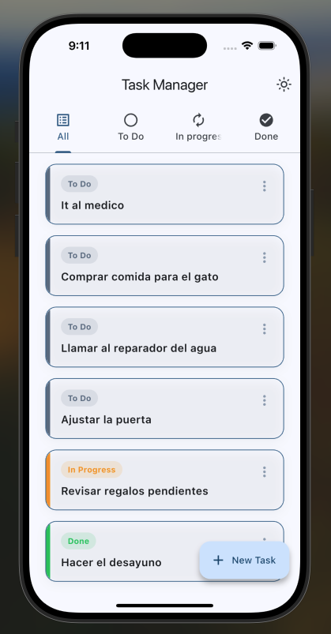
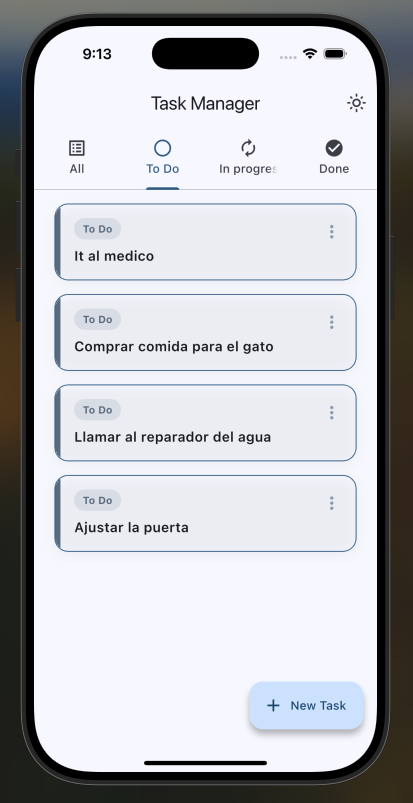
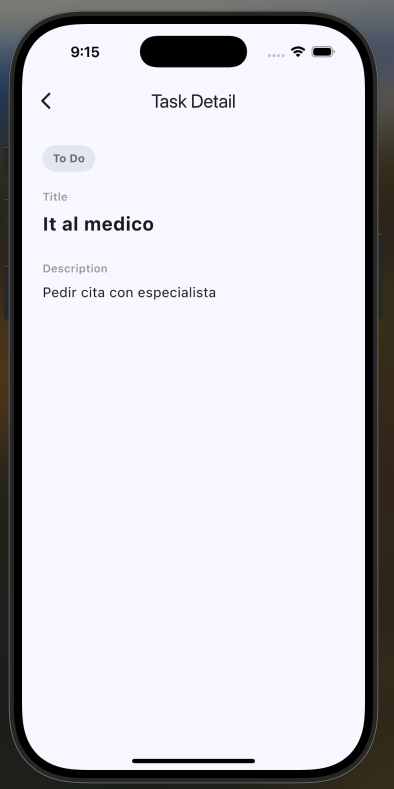
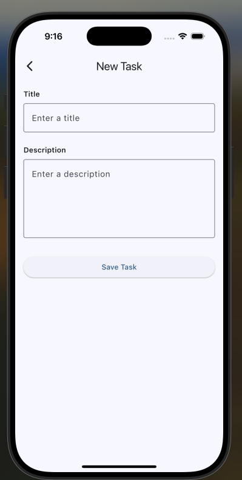
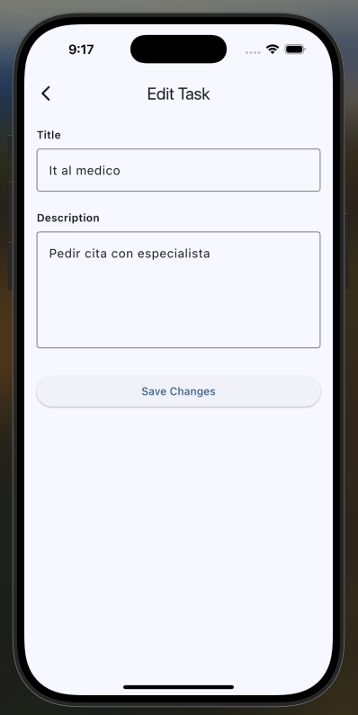
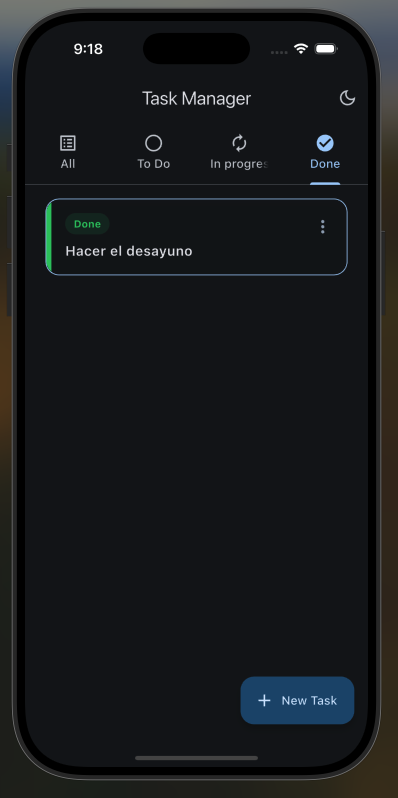

# Gestor de Tareas Personales

App móvil construida con Flutter para crear, organizar y hacer seguimiento de tareas personales. Permite gestionar el ciclo de vida de cada tarea desde su creación hasta su completitud, con persistencia local y soporte de tema oscuro.

---

## Screenshots

| Home – All | Home – To Do | Detalle |
|:---:|:---:|:---:|
|  |  |  |

| Nueva tarea | Editar tarea | Tema oscuro |
|:---:|:---:|:---:|
|  |  |  |

---

## Funcionalidades

- **Crear tareas** con título y descripción
- **Ver detalle** de cada tarea al tocarla
- **Editar** título y descripción de una tarea existente
- **Eliminar** tareas con confirmación previa
- **Avanzar estado** desde el menú contextual de cada tarjeta: `Por hacer → En proceso → Completado`
- **Filtrar por estado** mediante tabs: All, To Do, In Progress, Done
- **Tema oscuro / claro** con persistencia de la preferencia
- **Persistencia local** con SharedPreferences: las tareas se conservan al cerrar la app

---

## Tecnologías

| Paquete | Uso |
|---|---|
| [flutter_riverpod](https://pub.dev/packages/flutter_riverpod) | Gestión de estado |
| [shared_preferences](https://pub.dev/packages/shared_preferences) | Persistencia local |
| [uuid](https://pub.dev/packages/uuid) | Generación de IDs únicos por tarea |

---

## Estructura del proyecto

```
lib/
├── core/
│   ├── enums/
│   │   └── task_states.dart       # Estados posibles de una tarea con color asociado
│   ├── models/
│   │   └── task.dart              # Modelo inmutable de tarea
│   ├── providers/
│   │   ├── preference_provicer.dart  # Provider de SharedPreferences (inyectado en main)
│   │   ├── tasks_provider.dart    # Estado y lógica de la lista de tareas
│   │   └── theme_provider.dart    # Estado del tema claro/oscuro
│   └── storage/
│       └── preference_service.dart   # Abstracción sobre SharedPreferences
├── screens/
│   ├── home_screen.dart           # Pantalla principal con tabs por estado
│   ├── add_task_screen.dart       # Formulario para crear una tarea
│   ├── edit_task_screen.dart      # Formulario para editar una tarea existente
│   └── task_detail_screen.dart    # Vista de detalle de una tarea
├── theme/
│   └── app_theme.dart             # Definición de temas claro y oscuro
├── widgets/
│   └── task_card.dart             # Tarjeta reutilizable para mostrar una tarea
└── main.dart                      # Punto de entrada y configuración de providers
```

---

## Cómo correr el proyecto

**Requisitos previos:** Flutter SDK instalado. Verificar con:

```bash
flutter doctor
```

**Pasos:**

```bash
# 1. Clonar el repositorio
git clone https://github.com/slorduy/gestor_tareas_personales.git
cd gestor_de_tareas_personales

# 2. Instalar dependencias
flutter pub get

# 3. Correr la app
flutter run
```

---

## Flujo de estados de una tarea

```
Por hacer  ──▶  En proceso  ──▶  Completado
```

El avance es unidireccional. Una tarea completada no puede retroceder de estado.

---

## Decisiones de diseño

- **Modelo inmutable:** `Task` tiene todos sus campos `final`. Cualquier modificación crea una nueva instancia, lo que hace los cambios trazables y evita mutaciones accidentales.
- **Inyección de SharedPreferences:** Se inicializa en `main()` antes de `runApp` y se inyecta vía `ProviderScope.overrides`, desacoplando los providers del acceso directo a disco y facilitando tests.
- **Color en el enum:** `TaskStates` lleva el color asociado directamente para evitar lógicas de mapeo dispersas en la UI.
